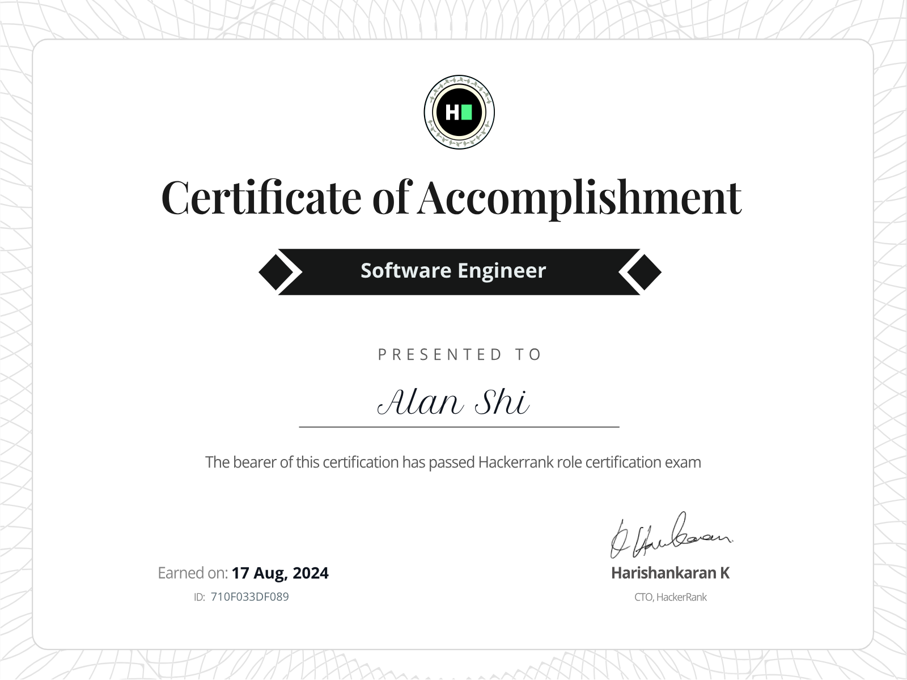
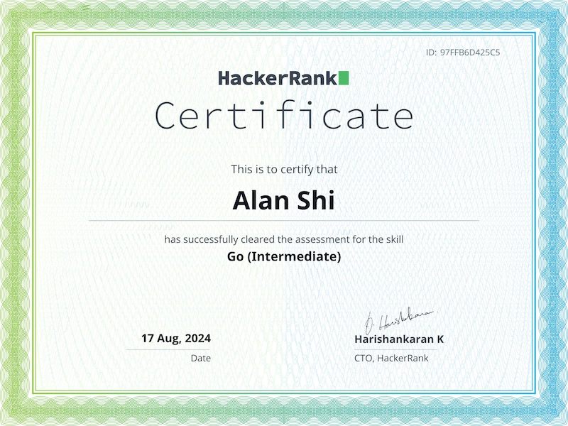
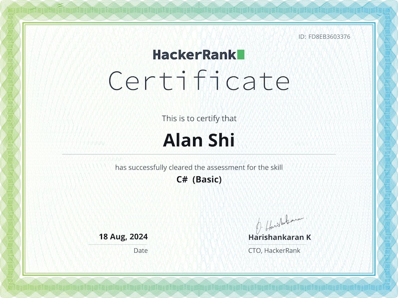

[](https://git.io/typing-svg)

[](https://git.io/typing-svg)

### <a href="https://tylerfft.vercel.app">🔗 My Portfolio</a></br>

<p align="left">
    
</p>

### ✌️ About Me

- 🏫 I'm a Full Stack Developer
- 👨‍💻 I’m looking for `A Job Opportunity In Web3`
- 💻 Ask me about `Nextjs`, `TailwindCSS`,`GO`, `React`, `Web3`, `Solidity`, `NTF`, `DAO`
- 📧 How to reach me [tyler.fft@gmail.com](https://tyler.fft@gmail.com) 

### 🫵 Who Am I ?

```python
import java.util.List;

public class WhoAmI {
    public static String user = "Alan Shi";
    public static String working = "A job pppotunity in Web3";
    public static List<String> skills = List.of("Nextjs", "Solidity", "Web3", "React", "TS", "React", "MySQL", "DAO");
    public static List<String> positions = List.of("Full Stack Developer", "Web Developer", "Backend Developer");
    public static List<String> hobbies = List.of("Gaming", "Music", "Coding", "Learning New Things");

    public static String getCity() {
        return "Suzhou,China";
    }

    public static String ambition() {
        return "Become a Software Engineer";
    }

    public static void main(String[] args) {
        System.out.println("My name is         : " + user);
        System.out.println("I am looking for   : " + working);
        System.out.println("My skills are      : " + skills);
        System.out.println("I can join with    : " + positions);
        System.out.println("My hobbies are     : " + hobbies);
        System.out.println("I live in          : " + getCity());
        System.out.println("My ambition is     : " + ambition());
    }
}
```
### 🔥 My Skills

<div align="center">

| Title                          | Icon                                                                                                             |
|--------------------------------|------------------------------------------------------------------------------------------------------------------|
| Programming Languages          |                                              |
| Scripting Languages            |                                                              |
| Framworks & Libraries          |  |
| Tools                          |                    |
| Databases                      |                                                         |
| Version Control                |                                                     |
| Others                         |                                                      |

</div>


### 💻 Connect With Me

<p align="left">
    <a href="https://www.linkedin.com/in/tyler-fft/" target="_blank">
    
    </a>
    <a href="https://github.com/tylerfft" target="_blank">
    
    </a>
    <a href="https://www.hackerrank.com/tyler_fft" target="blank">
    
    </a>
</p>

### 💫 Certificates

<a href="https://www.hackerrank.com/certificates/710f033df089" target="_blank">
</a>
<a href="https://www.hackerrank.com/certificates/a7f0aa1ca0c4" target="_blank">
</a>
<a href="https://www.hackerrank.com/certificates/97ffb6d425c5" target="_blank">
</a>
<a href="https://www.hackerrank.com/certificates/f076766d8418" target="_blank">
</a>
<a href="https://www.hackerrank.com/certificates/fd8eb3603376" target="_blank">
</a>
</p>


 
### ⭐️ GitHub Stats


 


 


 
### ✍️ Random Dev Quote


### 🤞 𝐃𝐨𝐧𝐚𝐭𝐢𝐨𝐧

**_If you enjoy what I do, please consider buying me a coffee. Your support is greatly appreciated and fuels my
motivation to keep providing quality assistance_** 🥺👇

<p align="center">
<a href="https://www.buymeacoffee.com/tylerfft
" target="_blank">
  
</a>
</p>
<h4 align="center"><i>Thank you for coming to my GitHub Profile 🤝 Have a wonderful day!</i></h4>

